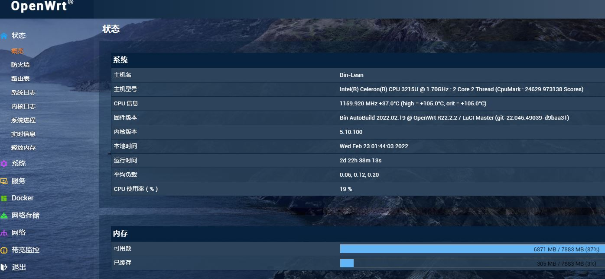
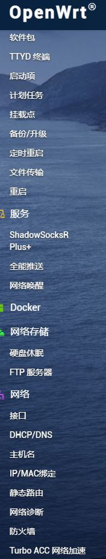

x64精简版 x64懒人版 armv8精简版  armv8懒人版

# Actions-OpenWrt  
🚀 推荐本人[➦自用稳定不限量机场](https://mosuplus.com/#/register?code=FJdHucY9),活动限时5折优惠码（最后两天，4月1日结束）：mosuplus。本仓库默认每天晚上自动编译。每天保持固件最新，[➦我的自建源](http://256pd.top:9666/) 里插件和依赖最新      

## 注：所有固件默认管理IP为：192.168.7.1 密码：password   
  主仓库使用[➦L大佬](https://github.com/coolsnowwolf/lede)，armv8系列打包库和内核使用[➦F大佬](https://github.com/unifreq)    
[➦我的自建源](http://256pd.top:9666/)     

## 固件特色：   
1.各型号固件分为精简版(只具备基本上网功能和极少数插件)和懒人版(包含大部分插件的高大全版本)   
2.精简版在系统-软件包,里面刷新列表后查找要安装的插件,可以在线安装懒人版里所有插件,此功能只需安装插件的luci即可(如luci-app-openclash)，其他依赖会全部自动跟着安装好,需要什么安装什么。也可以去[➦我的自建源](http://256pd.top:9666/)查找下载插件或者依赖。     
3.armv8系列固件包含目前常用的电视盒子openwrt固件(N1、贝壳云等)，F大发布的支持的盒子固件这里都有.   
4.armv8系列固件内置晶晨宝盒,可以在线更新最新固件、内核等。     
5.欢迎有缘人一起维护。(因本人小白且时间有限)     

### 精简版自带插件

### 懒人版自带插件就不一一列举了，总之你想要的大部分都有

## 致谢

- [P3TERX](https://github.com/P3TERX/Actions-OpenWrt)   
- [id77](https://github.com/id77/OpenWrt-K2P-firmware)
- [Microsoft](https://www.microsoft.com)
- [Microsoft Azure](https://azure.microsoft.com)
- [GitHub](https://github.com)
- [GitHub Actions](https://github.com/features/actions)
- [tmate](https://github.com/tmate-io/tmate)
- [mxschmitt/action-tmate](https://github.com/mxschmitt/action-tmate)
- [csexton/debugger-action](https://github.com/csexton/debugger-action)
- [Cisco](https://www.cisco.com/)
- [OpenWrt](https://github.com/openwrt/openwrt)
- [Lean's OpenWrt](https://github.com/coolsnowwolf/lede)
- [ncipollo](https://github.com/ncipollo/release-action)
