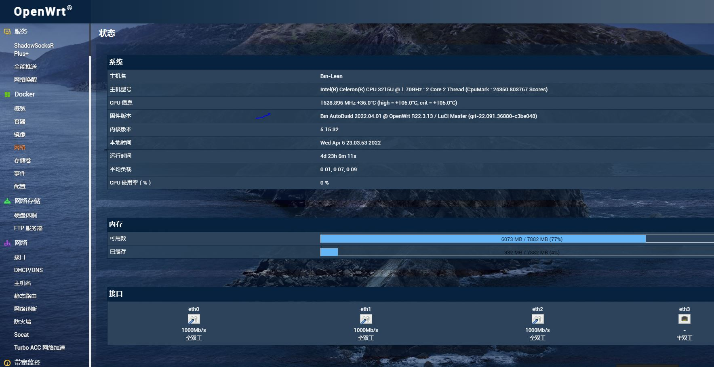

x64精简版  x64懒人版  armv8精简版  armv8懒人版 

       

# Actions-OpenWrt  
🚀 推荐本人[➦自用机场](https://xn--clouds-o43k.com/#/register?code=Eys6COZC) 便宜量大稳定10元1T每月。      
本仓库默认每天自动编译。每天保持固件最新      

## 注：所有固件默认管理IP为：192.168.7.1 密码：password   
  主仓库使用[➦L大佬](https://github.com/coolsnowwolf/lede)，armv8系列打包库和内核使用[➦F大佬](https://github.com/unifreq)        
  默认编译luci24.10版本      

## 固件特色：   
1.各型号固件分为精简版(只具备基本上网功能和极少数插件)和懒人版(包含大部分插件的高大全版本)   
2.armv8系列固件包含目前常用的电视盒子openwrt固件(N1、贝壳云等)，F大发布的支持的盒子固件这里都有.   
3.armv8系列固件内置晶晨宝盒,可以在线更新最新固件、内核等。           

### 精简版自带插件

### 懒人版自带插件就不一一列举了，总之你想要的大部分都有

## 致谢

- [P3TERX](https://github.com/P3TERX/Actions-OpenWrt)   
- [id77](https://github.com/id77/OpenWrt-K2P-firmware)
- [Microsoft](https://www.microsoft.com)
- [Microsoft Azure](https://azure.microsoft.com)
- [GitHub](https://github.com)
- [GitHub Actions](https://github.com/features/actions)
- [tmate](https://github.com/tmate-io/tmate)
- [mxschmitt/action-tmate](https://github.com/mxschmitt/action-tmate)
- [csexton/debugger-action](https://github.com/csexton/debugger-action)
- [Cisco](https://www.cisco.com/)
- [OpenWrt](https://github.com/openwrt/openwrt)
- [Lean's OpenWrt](https://github.com/coolsnowwolf/lede)
- [ncipollo](https://github.com/ncipollo/release-action)
